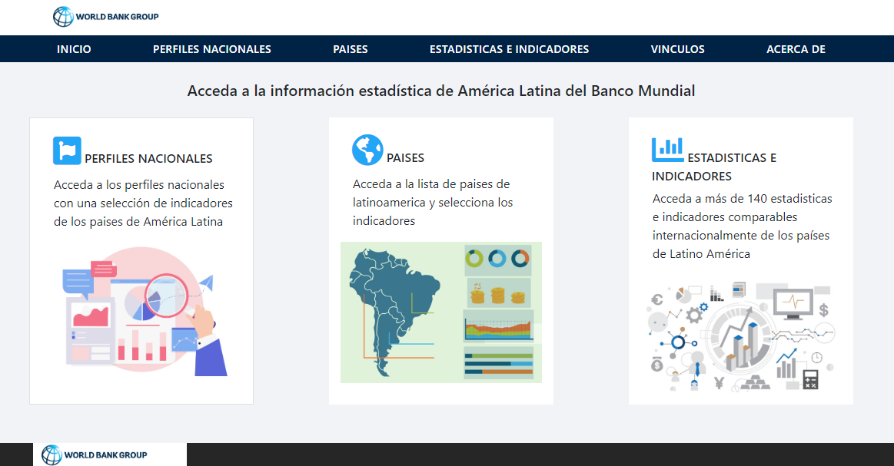

#Datos abiertos del Banco Mundial - Región Latinoamericana 

## Índice

* [Definición del producto](#Definición-del-producto)
* [Identificación del problema](#Identificación-del-problema)
* [Solución](#Solución)
* [Usuarios](#Usuarios)
* [Entrevistas](#Entrevistas)
* [Historias de usuario](#Historias-de-usuario)
* [Prototipos](#Prototipos)
* [Test de usabilidad](#Test-de-usabilidad)
* [Planificación](#Planificación)

### Definición del producto
Datos abiertos del Banco Mundial - Región Latinoamericana,  es una plataforma que permite acceder a estadísticas e indicadores de países a nivel latinoamericano. Está estructurado en 3 áreas principales de búsqueda: sección “perfiles nacionales”,   donde podrás acceder a los perfiles nacionales con una selección de indicadores por país, sección “países”, donde podrás acceder a la lista de países de latinoamérica y seleccionar un indicador específico y por último la sección “estadísticas e indicadores” donde podrás acceder  a más de 140 indicadores comparables internacionalmente. Es una web amigable e intuitiva, con una interfaz sencilla y fácil de usar. 

### Identificación del problema:  
Se requiere una aplicación que permita visualizar información estadística sobre la región Latinoamericana.

### Solución
Desarrollar una plataforma open access con datos estadisticos que diversas fuentes han recabado sobre la región Latinoamericana.

### Usuarios

Está aplicación va dirigida principalmente a  investigadores y estudiantes del área de las ciencias sociales que tengan  manejo básico de bases de datos así como también personas que trabajan en Institutos Nacionales de Estadísticas tanto a nivel nacional como internacional. 

### Entrevistas

Al inicio del proyecto entrevistamos a 3 personas con diferentes niveles de experiencia en el manejo de sitios web con datos estadísticos para  identificar sus necesidades y así recabar información acerca del uso de este tipo de sitios.

Algunos de los resultados que obtuvimos fueron:
* Cuándo los usuarios ingresan a un sitio web con datos estadísticos  tienden a realizar búsquedas por países o por indicadores y sobre eso aplican filtros.
* Los datos más relevantes que les gustaría ver en este tipo de sitios web son categorías de búsqueda, despliegue de gráficos y que tenga los datos actualizados.
* Tener la opción de ordenar la información presentada, por año, de mayor a menor, de menor a mayor, por pais, por nombre del indicador.
* Cuando los usuarios encuentran la información que necesitan, desean principalmente desplegar gráficos y poder descargar las series. 
* Los usuarios prefieren tener la mayor cantidad posible de formatos para la visualización y descarga de información, por ejemplo: Excel, HTML, gráficos, XML, etc.

### Historias de usuario: 
Enlace a las  [Historias de usuario] (https://docs.google.com/spreadsheets/d/11cW0NoVatY784eR3hEgcBW1bU0F4EV33zpel9Om-lzM/edit?usp=sharing)

### Prototipos
#### Prototipo de baja fidelidad
Realizamos un sketch con papel y lápiz tratando de plasmar los resultados de la etapa anterior con todos los requerimientos que recabamos. 

Enlace al [SKETCH] (https://docs.google.com/presentation/d/1c7aRi_Q33CougFS864z6u3LBq_LrAiYTghtB81PifWU/edit?usp=sharing)

#### Prototipo de alta fidelidad
Desarrollamos el prototipo en Figma, el cual nos permitió imitar el aspecto y el comportamiento de una interfaz real.

Enlace a [FIGMA] (https://www.figma.com/file/VOzAabJKUFxMbD1B0agsz4kP/Data-Lover?node-id=0%3A1)

### Test de usabilidad
Testeo realizado a un usuario con el prototipo de baja fidelidad

**Objetivo

Verificar si la aplicación es comprensible

**Tareas

1. Si tuvieras que revisar las estadísticas económicas de Chile ¿Cómo lo harías?
2. Busca el indicador "prevalencia de anemia en mujeres"
3. Si logra la anterior, descarga la información en un archivo PDF
4. Encuentra los indicadores estadísticos para México.

**Conclusiones

* Indicar con otro nombre la página principal, usuario no comprende que "portada" es el inicio en la barra de navegación.
* A simple vista el usuario no comprende sólo con el título las 3 secciones de la página principal, hay que describirlas.
* Generar una lista con todos los indicadores no amigable para el usuario

**Posibles soluciones

* Cambiar el nombre de "portada" a "inicio" en la barra de navegación.
* Describir las secciones principales en el index.
* Categorizar los indicadores con su respectivo selector para acotar la lista de indicadores.

### Planificación
Para planificar y coordinar las tareas del proyecto, se utilizó principalmente Trello. También utilizamos una pizarra en forma paralela, la cual modificamos día a día conforme íbamos avanzando en el proyecto.

Ver planificación en [TRELLO](https://trello.com/b/29ojPLpI/proyecto-data-lovers)
